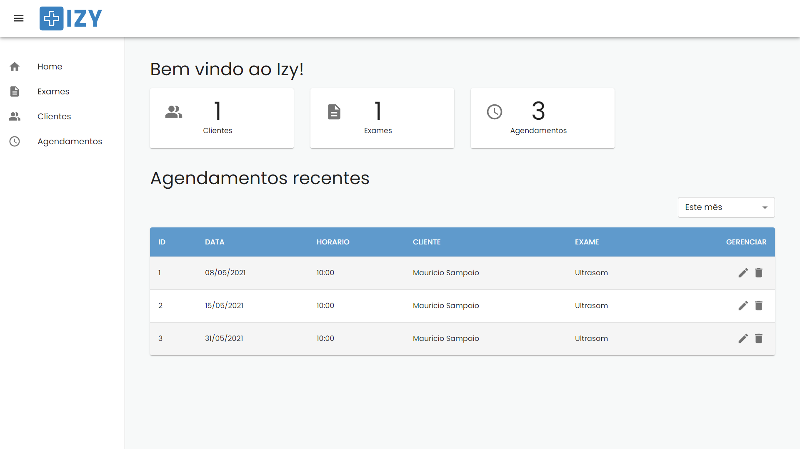
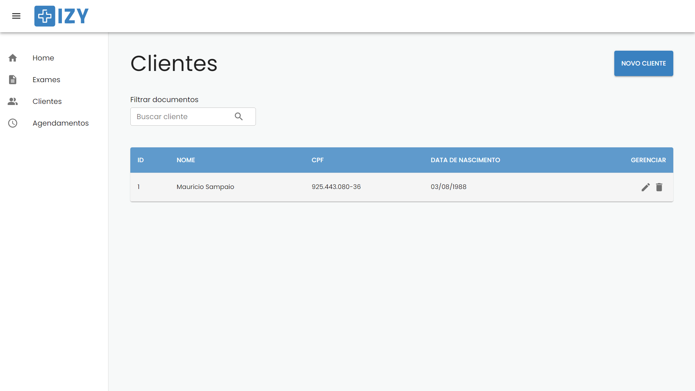

<h1 align="center">
    Izy
</h1>

<p align="center">
  <a href="#page_facing_up-sobre">Sobre</a>&nbsp;&nbsp;&nbsp;|&nbsp;&nbsp;&nbsp;
  <a href="#computer-web">Web</a>&nbsp;&nbsp;&nbsp;|&nbsp;&nbsp;&nbsp;
  <a href="#iphone-mobile">Mobile</a>&nbsp;&nbsp;&nbsp;|&nbsp;&nbsp;&nbsp;
  <a href="#rocket-tecnologias-utilizadas">Tecnologias Utilizadas</a>&nbsp;&nbsp;&nbsp;|&nbsp;&nbsp;&nbsp;
  <a href="#gear-como-configurar-e-executar">Como configurar e executar</a>&nbsp;&nbsp;&nbsp;|&nbsp;&nbsp;&nbsp;
</p>

<br/>

<h3 align="center">
  
</h3>

<br/>


## :page_facing_up: Sobre

O Izy é um aplicativo desenvolvido para o processo seletivo Dev Trainee DEVinHouse <a href="https://www.softplan.com.br/">Softplan</a>. 

Para maiores informações sobre os requisitos veja em <a href="https://github.com/jeffersonoh/devinhouse-desafio-devtrainee">devinhouse-desafio-devtrainee</a>.

<br/>

## :computer: Web

<h3 align="center">
  
</h3>

<br/>

## :iphone: Mobile

<h3 align="center">
  
</h3>

<br/>

## :rocket: Tecnologias Utilizadas

- React
- Java
- Spring Boot

<br/>

## :gear: Como configurar e executar

```bash

    # Clonar o repositório
    $ git clone https://github.com/mausampaio/devinhouse-desafio-devtrainee 'izy'

```

### Utilizando o Docker

A imagem backend está no Docker Hub como mausampaio/izy-backend. Já existe um docker-compose.yml com as instruções para buscar essa imagem e subir o frontend em ambiente de desenvolvimento.

```bash

    # Navegar para o diretório do frontend
    $ cd izy/frontend

    # Para subir os containers
    $ docker-compose  up -d

```

Caso queira buildar o backend siga os seguintes passos:

```bash

    # Navegar para o diretório do backend
    $ cd izy/backend

    # Faça o build do backend

    # Caso Linux ou MacOS
    $ ./mvnw package
    # Caso Windows
    $ ./mvnw.cmd package

    # Para subir o container
    $ docker-compose  up -d

```

### Sem o Docker

Para subir o backend:

```bash

    # Navegar para o diretório do backend
    $ cd izy/backend

    # Faça o build do backend

    # Caso Linux ou MacOS
    $ ./mvnw package
    # Caso Windows
    $ ./mvnw.cmd package

    # Navegar para a pasta target
    $ cd /target

    # Execute o arquivo .jar
    $ java -jar backend-0.0.1-SNAPSHOT.jar

```

Para subir o frontend:

```bash

    # Navegar para o diretório do frontend
    $ cd izy/frontend

    $ npm install
    # ou
    $ yarn

    # Para iniciar a aplicação
    $ npm start
    # ou
    $ yarn start

```

<br/>

---

<h4 align="center">
  Feito com :purple_heart: by <a href="https://www.linkedin.com/in/mausampaio/" target="_blank">Maurício Sampaio</a>.
</h4>